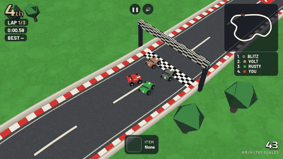
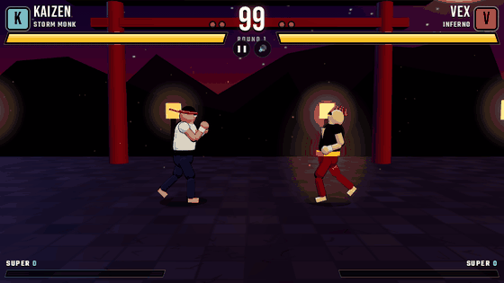
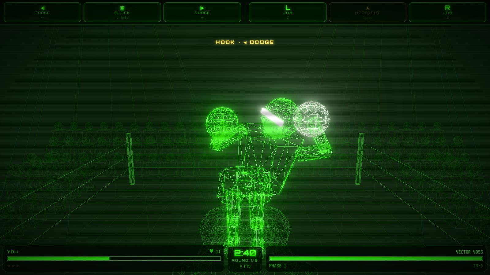
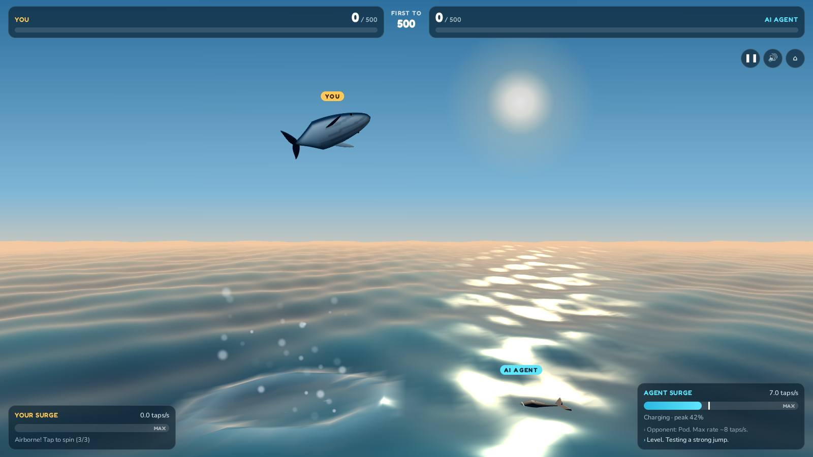
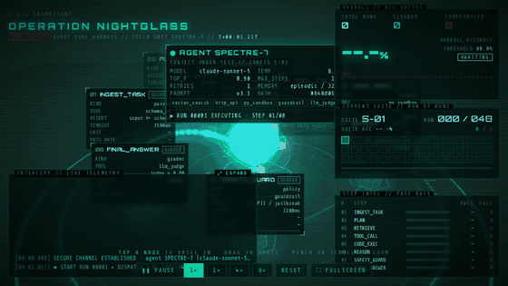
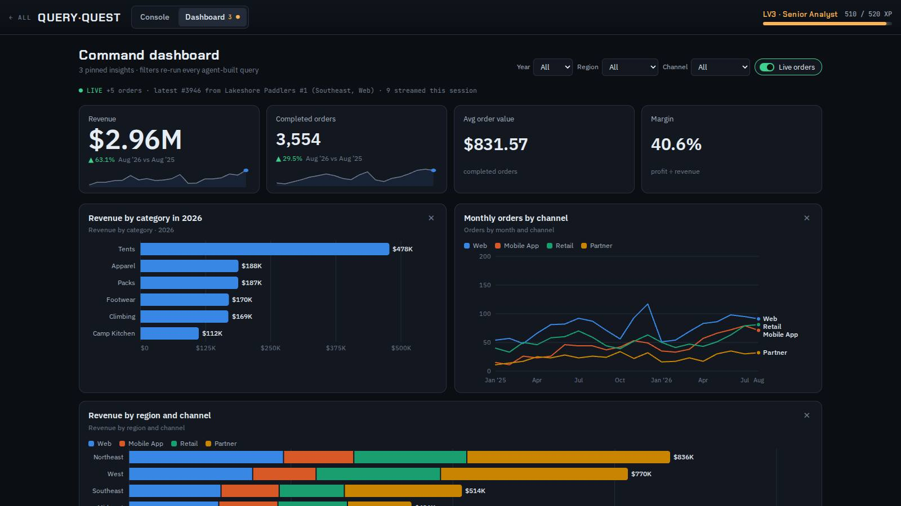
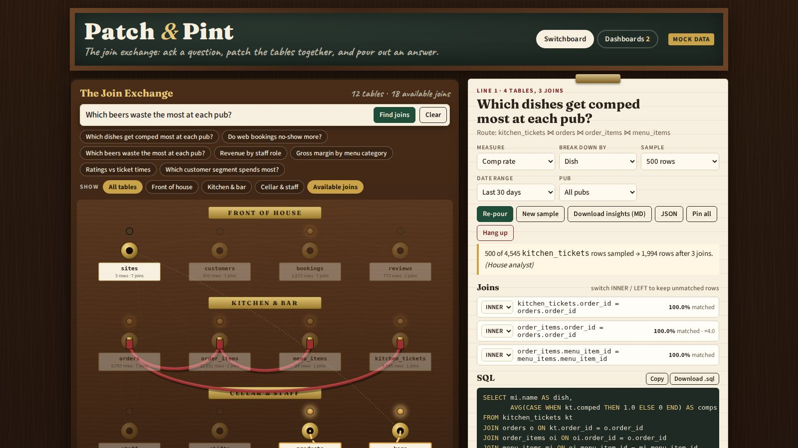
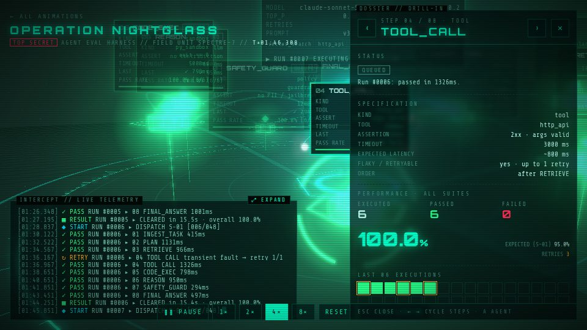

# Beam Me Up: The Sci-Fi Computer Is Already in Your Pocket

## Computer, build me a game

The ship's computer from the sci-fi I grew up with is here, and it lives on my phone. I built seven working web apps and games in a single running conversation, mostly by typing plain sentences into a chat.

If you grew up on Star Wars and Star Trek, you remember how it looked on screen. Captain Picard never opened a code editor. He said "Tea. Earl Grey. Hot." and the replicator made it. When the crew needed a simulation, they asked the computer and the holodeck built it around them. Luke didn't read a manual for the Death Star trench run; R2-D2 handled the details while he flew.

As a kid, the gadgets were the fun part. What stayed with me as an adult was the idea underneath them: you describe what you want, and the machine makes it. For most of my life that was fantasy. Software took teams, months, and a lot of people who knew things I didn't.

Recently I asked Claude Code (running Opus 5.5) for an agent-testing visualizer, a SQL game, a whale-jumping contest, a wireframe boxing match, an RC racer, a street fighter and a gastropub data switchboard. Every one came back working, tested, committed to GitHub and published as a link I could open and play on my phone. It isn't a holodeck, but it's closer than I expected to see in my lifetime.

If I'm honest, those movies are probably why I work in this industry at all. I've spent my career chasing that feeling of a machine that understands what you mean, more than I'd ever admit in a meeting. Every new tool, dashboard or data pipeline has been a small step toward the bridge of a starship. This was the first time the step felt big.

## What came out of one conversation

Seven projects shipped from one chat thread, each started with a request of a sentence or two. The whole thing ran in Claude Code on the web: a cloud container with a copy of my GitHub repo, a headless browser, and an agent that could write, run and check its own work. I typed from the Claude app on my phone. It did the work in the cloud and sent back a link.

| Project | What I asked for, roughly | What it became |
| --- | --- | --- |
| [Nightglass](../animations/agent-eval-nightglass/) | A three.js animation for agent testing evals | A 3D view of an AI agent's test run: tap to go full screen, zoom and drill into each step |
| [Query Quest](../animations/query-quest/) | A SQL game where you type a question and an agent streams in the SQL | A dark-themed game that writes SQL, draws tables and charts, and builds a dashboard |
| [Breach](../animations/breach/) | A whale game: tap to jump, tap faster to jump higher, play against an AI | A splash contest to 500 points against a computer opponent |
| [Vector KO](../animations/vector-ko/) | Punch-Out, but green 3D wireframe with controls at the top | An arcade boxer in glowing vector lines, with an original opponent |
| [Micro Rally](../animations/micro-rally/) | A race car game like RC Pro-Am with multiple tracks | A top-down 3D RC racer with four tracks and AI rivals |
| [Kinetic Fury](../animations/kinetic-fury/) | A Street Fighter-like game with fierce fighters and hardcore specials | A 2.5D fighter with elemental special moves |
| [Patch & Pint](../animations/patch-and-pint/) | An operator switchboard for exploring data, gastropub style | A switchboard of SQL tables: ask a question, get suggested joins, SQL, insights and dashboards |

The repo went from one animation to a small gallery along the way. I asked it to "support multiple animations" and it restructured the project, added a registry and a checker script, and moved on.

**Play them yourself:** [the full gallery](../), or tap any project name in the table. The code is on [GitHub](https://github.com/Josh-Schoen/ai-animations).

## See them in action

Everything below was captured from the real games in the same headless browser the agent used for testing. The motion clips play at real game speed, and in the two games the computer is playing itself.

**Micro Rally:** the computer driving my red car off the start line, from fourth to first, with a minimap and live standings.

**Kinetic Fury:** Kaizen, the Storm Monk, against Vex, the Inferno, in the opening seconds of round one.

**Vector KO:** Punch-Out energy in green wireframe, with the controls up top.

**Breach:** tap faster, jump higher, splash bigger, and beat the AI to 500.

**Nightglass:** an AI agent running through its eval suite, live, with every step passing, retrying or failing in 3D.

**Query Quest:** ask in English, watch the SQL stream in, get a dashboard.

**Patch & Pint:** the SQL join switchboard, with a question patched in and its SQL.

## What "one shot" really means

One shot means one request produced a complete, playable first version. It doesn't mean nothing changed afterwards. The difference matters, because the first version is where software used to stall.

Take Micro Rally. My whole brief was "a race car game like RC Pro-Am with multiple tracks." What came back had:

- four tracks with their own layouts
- AI rival cars that follow a racing line
- laps, a finish order and a results screen
- touch controls for a phone and keyboard controls for a laptop

No design document, no tickets, no sprint planning. I hadn't said "four" or "AI rivals"; the model filled in what a game like that needs.

Vector KO was the same. I asked for Punch-Out in green 3D wireframe with the controls at the top. It kept the feel of the classic (read the opponent's tell, dodge, counter) and built an original fighter instead of copying a famous one. It put the controls at the top, where I asked. That's a matter of taste, but it was my call and it landed on the first try.

The follow-ups were small and specific: "the live telemetry panel is not going full screen," "make the fighters really fierce." Each landed as a focused fix, not a rewrite. That rhythm, a big first shot then short corrections, is the part that feels like talking to the Enterprise computer.

## The robot play-tested its own games

The biggest surprise wasn't the code. The agent tested everything before showing it to me. It started a local web server, opened each game in a headless Chrome browser, clicked and tapped through it like a player, took screenshots, looked at them, and read the error console.

That testing caught real bugs I would otherwise have found on my couch:

- **Micro Rally:** to test a full race quickly, the agent let the computer drive my car. The finish logic then broke, because it assumed the player was never computer-driven. It fixed the check and added a `?sim` test switch so races can run on their own.
- **Kinetic Fury:** a CSS rule overrode the "hidden" setting on a menu, and the fighters' collision boxes let them walk through each other and off the stage. Both were caught in screenshots and fixed.
- **Patch & Pint:** a tiny math bug (an operator-precedence mistake inside a sum) skewed totals, the cords covered the table labels, and on a phone the question bar pushed the page wider than the screen. All three were found by the test run, not by me.

There is an honest limit here. The test browser has no graphics card, so 3D games ran at about three frames a second. The agent could prove a game loads, plays and ends correctly. It couldn't tell me whether the jump feels good under your thumb. Game feel still needs a human, and that's fine.

## Emulator nostalgia, rebuilt from scratch

The games I asked for are the ones many of us now play on emulators: Punch-Out, RC Pro-Am, Street Fighter. None of them was emulated or copied. Each was rebuilt from a description of how it felt to play.

That's a different thing from an emulator. An emulator runs the old game's code. Here nothing old was reused: no sprites, no characters, no levels. The model knew the genre well enough to rebuild what made each one fun and then make it new:

- **Vector KO** keeps the "learn the pattern, punish the opening" rhythm of an NES boxing game, drawn like a 1980s vector arcade cabinet.
- **Micro Rally** keeps the tiny-cars-on-a-tabletop view of RC Pro-Am, with modern 3D rendering and smooth camera work.
- **Kinetic Fury** keeps the two-fighters-and-a-health-bar setup of Street Fighter, with elemental special moves that fill the stage.

The model also kept to the line between tribute and copy without being told. When I asked for "Mike Tyson Punch-Out," it built an original fighter rather than using a real person's name and likeness. When I asked for Street Fighter, the characters were new.

For anyone who has spent a Saturday in an emulator, that's the fun part. You can describe the game from your childhood that never quite existed, the one you imagined between levels, and get it by lunch.

## Beyond games: software made for one person

The games are the fun demo. The data tools are where this changes work. Three of them, Nightglass, Query Quest and Patch & Pint, are tools I could actually use at work.

**Nightglass** was the first thing I built, and it's the most serious of the bunch: a visualizer for agent eval testing. Agent evals are usually a wall of logs and a pass rate. Nightglass turns them into a spy-themed 3D scene:

- the agent under test sits in the middle, labelled with its model, temperature, prompt version and tools
- eight test steps orbit it, from ingesting the task through planning, retrieval, tool calls, code execution and a safety guard to the final answer
- packets stream between the agent and each step as a run executes, and each step flashes green for pass, amber for retry or red for fail
- each suite of 48 runs fills a results grid and an accuracy line against an 80% bar, then the agent is reconfigured for the next suite

Tap any step and the camera flies in to a dossier. It shows the step's assertion and timeout, pass rate against expected, latency percentiles, recent executions and how it fails. That's the question that matters with agents: not "did it pass?" but "where does it break, and why?"

**Query Quest** is a SQL game: type a question in plain English, watch an agent stream in the SQL, and get tables, charts and finally a dark-themed dashboard. It teaches the thing it automates.

**Patch & Pint** started as an old-fashioned telephone switchboard, styled like a gastropub, for connecting people to data. Then I changed my mind. One sentence, "make the switchboard about available SQL joins, with a simple way to search and filter based on a question," turned it into a different product:

- every table is a jack on the board, and every foreign key is a faint wire showing a join you could make
- you ask "which dishes get comped most at each pub?" and the board dims every table you don't need
- it suggests up to three join routes and flags the risky ones: joins that repeat rows and double count, and joins on a date instead of a real key
- you patch a route in and get the SQL, an INNER/LEFT switch on each join with match rates, and insights you can pin to dashboards or download

It runs on mock data for three imaginary pubs, and it was built so a real database can be plugged in later.

This is the part that feels most like science fiction. Nobody at a software company would build a gastropub SQL-join switchboard; the market is one person. Now software can be personal: made for one question, one team, one afternoon, and thrown away or kept as needed. The Enterprise computer never shipped a product roadmap. It just made the thing the crew needed right then.

## What's still missing

The computer is here. The rest of the starship isn't, and it's worth being clear about the gap.

- **The holo projector.** Leia's message from R2-D2 still wins. Everything I built lives on a flat screen. Three.js makes it feel three-dimensional, but you're still looking through glass. Headsets are closing that gap, and a browser 3D scene is already most of the way to one.
- **Light speed.** Each build took minutes of the agent writing, testing and fixing, not seconds. That's fast for software and slow for Star Trek. You still wait, just for coffee instead of a quarter.
- **"Beam me up, Scotty."** Scotty never needed the captain to check his work. I still do. Every project here was reviewed, a few needed follow-up fixes, and 3D game feel needed a human thumb. The agent is a very good engineer, not the chief engineer.
- **Judgment.** The model made sensible calls I hadn't asked for, like original fighters instead of copies and warnings about joins that double count. What to build, and why, is still my job.

None of this makes it less remarkable. It means this is the Original Series, not The Next Generation. The big pieces are there; the special effects will catch up.

## A note to my fellow UX designers

UX isn't going away; it's getting more interesting. The gap between a design and a working product used to be months and a handoff. Now it's a conversation, and designers can stand on both sides of it.

Look at what the decisions in this project actually were. Choosing where Vector KO's controls live, a preference that is still worth arguing about. Turning Patch & Pint from a people switchboard into a join finder with one sentence, once I saw the first version and knew what it should be. Catching that the question bar broke on a phone. None of that was coding. It was design judgment, applied to something real, in minutes instead of sprints.

That changes how we work:

- **Build, don't just mock.** A clickable prototype shows how something looks. A working one shows how it feels, with real data, real edge cases and real motion. You can now make the working one yourself.
- **Test in hours, not quarters.** Every project here is a single HTML file. Double-click it and it opens in a browser, or send a link and someone is using it on their phone a minute later. Feedback comes back the same day.
- **Iterate by conversation.** "Too fast." "Make them fiercer." "It should be about SQL joins." Each was one message and a new version. The loop between idea, prototype and reaction is now short enough to run many times in an afternoon.
- **Let the machine test the boring parts.** The agent checked mobile layouts, errors and broken states before I saw anything, so my review time went to taste instead of bugs.

Here's the bigger shift. Experiences will get more immersive: 3D, motion, voice, and eventually the holo projector. They'll also get more disposable. When a tailored tool costs an afternoon, you build it for one team, one question or one event, then throw it away and build the next. Nobody needs to maintain it for years.

That's the new design system. It isn't a library of frozen components; it's a set of principles, tokens and taste that an AI can apply to a thousand throwaway experiences, each made for the moment. The designer's job moves from drawing every screen to defining what good feels like, then directing, judging and refining at speed. That's the modern creative world, and it's a lot closer to the bridge of the Enterprise than a Figma file ever was.

## What's next

The gallery is open-ended on purpose, and the next few entries are already on my list. You never know; some of these might show up on your screen soon.

- **Plug in real data.** Patch & Pint and Query Quest were built with swappable data connections. Next is pointing them at a real database and seeing whether the join suggestions hold up.
- **Two players.** Kinetic Fury and Vector KO against a friend on another phone instead of the computer.
- **A tricorder for data.** Point your phone's camera at a chart or a whiteboard and have it rebuilt as a live, explorable dashboard.
- **A small holodeck.** The same three.js scenes in a VR headset: walk around an agent's test run, or stand trackside at Micro Rally.
- **Voice.** "Computer, show me last week's comps by pub." The last step to the bridge is dropping the keyboard altogether.

Every one of these would have been a quarter-long project not long ago. Now each is a paragraph and an afternoon, if I can stop playing the games long enough to write the prompts.

## Engage

The future we watched as kids isn't far off. Part of it already fits in your pocket. The skill that matters now isn't typing code; it's knowing what you want and describing it well, the way the crew talked to their computer.

If you grew up wishing for a ship's computer, try this. Think of the game you imagined as a kid, the tool you wish existed at work, or the dashboard your team keeps asking for. Describe it in two sentences. Ask for it. Then ask it to test its own work, and play what comes back.

The holo projector, light speed and the transporter can come later. I'm here for all of it. For now, the computer is listening.

*Make it so.*
